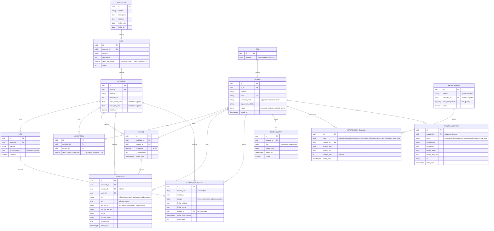

# 02 — Modelo de Datos Conceptual (Entidad-Relación)

**Proyecto:** Plataforma de Seguimiento y Monitoreo (PAC)
**Fase:** 1 de 16 — Arquitectura y Diseño Técnico
**Estado:** Borrador — pendiente de aprobación del usuario

Modelo conceptual (no físico): describe entidades, atributos clave y relaciones que soportan las reglas de negocio de la Fase 0. Terminología según `docs/fase-0-requisitos/01-glosario.md`.

## Diagrama entidad-relación

## Descripción de entidades

- **PROYECTO:** único registro; información general, objetivos y fechas globales.
- **FASE:** pertenece a un Proyecto; tiene `peso_porcentaje` (aporte al Proyecto). **Invariante:** la suma de pesos de las Fases del Proyecto = 100 % (RN-02).
- **ACTIVIDAD:** pertenece a una Fase. Guarda las fechas de la **Línea Base vigente** (`fecha_inicio_plan`, `fecha_fin_plan`) y `finalizada`. El **Estado** (Pendiente/En ejecución/Finalizada/Próxima a vencer/Vencida) es **derivado** en tiempo de consulta a partir de fechas, `finalizada` y las Reglas de Alerta (RN-03, RN-04); no se almacena para evitar inconsistencias.
- **HITO:** pertenece a una **Actividad** (RN-01); tiene `fecha_objetivo` (parte de la Línea Base) y `cumplido`.
- **ASIGNACION:** relación Actividad–Usuario(Colaborador) con `peso_trabajo_porcentaje`. **Invariante:** la suma de pesos por Actividad = 100 % (RN-08). Clave única (actividad_id, usuario_id).
- **AVANCE:** histórico append-only por Actividad y autor; `porcentaje` puede subir o bajar entre registros (RN-05). El último Avance por Colaborador alimenta el cálculo (RN-02).
- **EVIDENCIA:** asociada a una Actividad y opcionalmente a un Avance. Su **contenido/enlace es siempre privado** (RN-06, RN-13): los archivos se guardan como `archivo_ref` dentro del volumen y solo se sirven por endpoint autenticado; nunca por ruta pública. `url` solo aplica al tipo `enlace`.
- **CAMBIO_LINEA_BASE:** historial **inmutable** de cambios autorizados a fechas de la Línea Base (RN-07). Conserva `fecha_original`, `fecha_nueva`, `usuario_id`, `fecha_hora_cambio` y `justificacion`. La `fecha_original` nunca se sobrescribe: la Actividad/Hito guarda la fecha vigente y este historial preserva todas las anteriores.
- **USUARIO / ROL:** cuentas creadas por Administrador (sin autorregistro). `password_hash` con Argon2id (RN-16); `totp_secret_cifrado` para 2FA (RN-15). `estado` soporta activación y desactivación conservando datos (RN-14).
- **TOKEN_CUENTA:** tokens de activación y recuperación con expiración y marca de uso (soporta CU-03, flujos de correo).
- **REGLA_ALERTA:** configuración de anticipación de Alertas, global o por Actividad (RN-03, PA-08/PA-12); `dias_anticipacion` parametrizable, no hardcodeado.
- **NOTIFICACION_ENVIADA:** registro de envíos para **deduplicar** Alertas (una por umbral, RN-11) y para auditoría.
- **EVENTO_AUDITORIA:** registro **append-only** de acciones y accesos a datos sensibles (RN-17), inmutable (RN-18).

## Cómo el modelo soporta las reglas críticas

| Regla | Soporte en el modelo |
|------|----------------------|
| RN-01 (jerarquía; Hito→Actividad) | FK `FASE.proyecto_id`, `ACTIVIDAD.fase_id`, `HITO.actividad_id`. |
| RN-02 (avance ponderado) | `FASE.peso_porcentaje`, `ASIGNACION.peso_trabajo_porcentaje`; `AVANCE` como fuente; constraints `CHECK` de suma = 100 %. |
| RN-05 (avance sube/baja) | `AVANCE` append-only; sin restricción de monotonía; histórico completo. |
| RN-07 (línea base inmutable) | Fecha vigente en `ACTIVIDAD`/`HITO` + historial en `CAMBIO_LINEA_BASE` (sin update/delete). |
| RN-08 (multiasignación) | `ASIGNACION` N:M con peso; único por (actividad, usuario). |
| RN-06/RN-13 (evidencia privada) | `archivo_ref` fuera de webroot; servido solo por endpoint autenticado. |
| RN-14 (conservación) | `USUARIO.estado=inactivo` en lugar de borrar; FKs de Avance/Evidencia preservan autoría. |
| RN-11 (no duplicar alertas) | Unicidad lógica en `NOTIFICACION_ENVIADA` por (tipo, entidad, umbral_dias). |
| RN-16 (contraseñas) | `password_hash` (Argon2id); nunca se almacena texto plano. |
| RN-17/RN-18 (auditoría) | `EVENTO_AUDITORIA` append-only; permisos de BD revocan UPDATE/DELETE. |

## Invariantes a reforzar en base de datos (Fase 3/8)

- `SUM(FASE.peso_porcentaje) = 100` por Proyecto.
- `SUM(ASIGNACION.peso_trabajo_porcentaje) = 100` por Actividad (cuando hay asignaciones).
- `AVANCE.porcentaje BETWEEN 0 AND 100`.
- `EVENTO_AUDITORIA` y `CAMBIO_LINEA_BASE`: sin `UPDATE`/`DELETE` para el rol de aplicación.
- Unicidad de `USUARIO.email`.

> Nota: los tipos exactos, índices y constraints físicos se materializan en las migraciones de la Fase 3 (dominio) y Fase 8 (auditoría). Este documento es conceptual.
