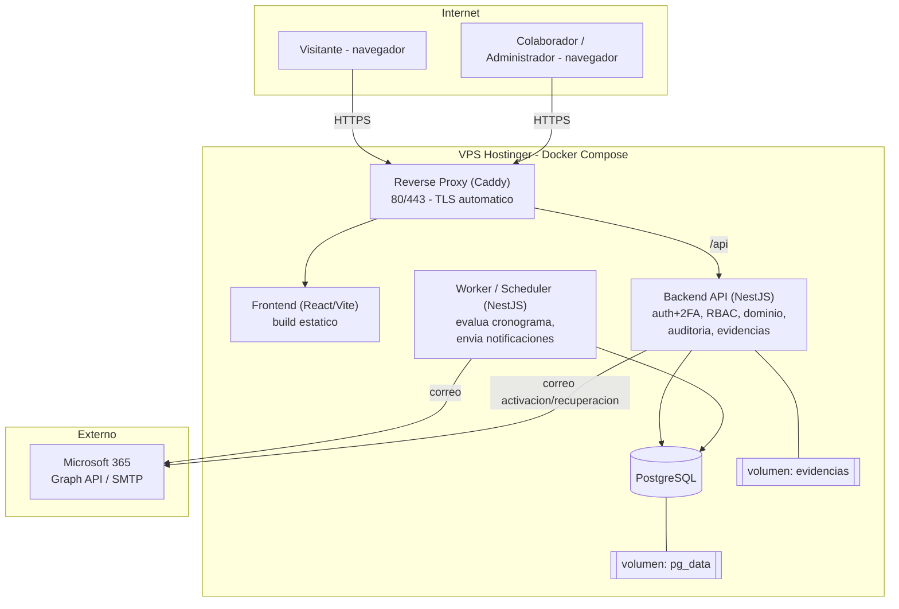

# 05 — Arquitectura de Contenedores y Despliegue

**Proyecto:** Plataforma de Seguimiento y Monitoreo (PAC)
**Fase:** 1 de 16 — Arquitectura y Diseño Técnico
**Estado:** Borrador — pendiente de aprobación del usuario

Diseño de despliegue en **Docker Compose** sobre un **VPS de Hostinger** (ADR-0008). Solo el reverse proxy expone puertos públicos (80/443); el resto vive en una red interna privada.

## Diagrama de contenedores

## Componentes

- **Reverse Proxy (Caddy):** termina TLS (Let's Encrypt automático), enruta `/` al Frontend y `/api` al Backend. Único servicio con puertos publicados.
- **Frontend (React/Vite):** build estático servido por el proxy. Consume `/api/public/**` (dashboard) y `/api/**` (panel autenticado).
- **Backend API (NestJS):** autenticación + 2FA, RBAC, lógica de dominio, cálculo de Avance, gestión de Línea Base, endpoints de Evidencias (subida y *streaming* autenticado), auditoría.
- **Worker/Scheduler (NestJS):** proceso independiente que evalúa el cronograma con la periodicidad configurada, genera Alertas (próxima a vencer/vencida), envía confirmaciones y notificaciones de cambios importantes, y registra en `notificacion_enviada` para no duplicar (RN-11).
- **PostgreSQL:** base de datos del dominio, usuarios, auditoría y notificaciones.
- **Volúmenes persistentes:** `pg_data` (datos de PostgreSQL) y `evidencias` (archivos de Evidencia, fuera del webroot; nunca servidos estáticamente por el proxy).
- **Microsoft 365 (externo):** envío de correo vía Graph API/OAuth2 (recomendado) o SMTP autenticado (ADR-0007).

## Flujos de petición

- **Petición pública (Visitante):** Navegador → Caddy → Frontend (estático) → llamadas a `/api/public/**` → API → PostgreSQL. **No** se toca el volumen de Evidencias ni se devuelve su contenido.
- **Petición autenticada (Colaborador/Admin):** Navegador → Caddy → `/api/**` → API (verifica sesión + 2FA + rol) → PostgreSQL y, para descargar Evidencia, *streaming* desde el volumen `evidencias` solo tras autorizar (RN-13).
- **Notificaciones (Sistema):** Worker (cron) → consulta PostgreSQL → evalúa umbrales de Reglas de Alerta → envía correo por Microsoft 365 → registra en `notificacion_enviada`.

## Entornos y configuración

- **Entornos:** desarrollo, pruebas y producción, con archivos Compose diferenciados (`docker-compose.yml` y `docker-compose.prod.yml`; se crean en Fase 2/13).
- **Secretos:** credenciales de base de datos, secreto de cifrado de TOTP, y credenciales de Microsoft 365 se inyectan como **variables de entorno/secretos**, nunca hardcodeadas (Fase 2/13).
- **Red:** una red interna de Docker; solo Caddy publica 80/443. PostgreSQL no se expone al exterior.

## Consideraciones y dependencias a confirmar

- **⚠️ Plan de Hostinger (PA-20/PA-21):** confirmar RAM/CPU/disco, soporte de Docker/Docker Compose y disponibilidad de puertos 80/443. La arquitectura asume un **VPS con Docker**, no hosting compartido.
- **⚠️ Envío de correo (ADR-0007):** confirmar si el tenant de Microsoft 365 permite SMTP AUTH o si se requiere registrar app en Entra ID con `Mail.Send`.
- **Dimensionamiento (PA-03/PA-04/PA-05):** el número de contenedores es fijo; el tamaño de recursos y del volumen de Evidencias depende de los volúmenes estimados, aún abiertos.
- **Respaldos (Fase 14):** `pg_data` y `evidencias` deben incluirse en la estrategia de respaldo; el diseño lo prevé pero no lo implementa aquí.
- **Escalado futuro:** si crece el volumen de Evidencias, migrar a almacenamiento S3-compatible (MinIO) según ADR-0005 sin cambiar el modelo de dominio.
